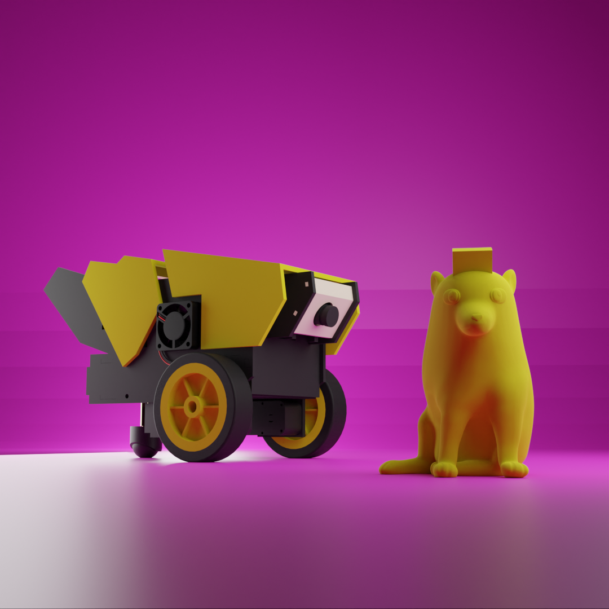

# CheemsCar
## Il nostro robot studiato per imparare la robotica da zero

La CheemsCar è un robot open source, modulare e facilmente costruibile. Utilizza componenti tagliati al laser e stampati in 3D, oltre che un Arduino Uno (con una particolare Arduino Shield progettata da noi) e un Rasperry Pi. La CheemsCar è in grado di guidare in una strada, riconoscere cartelli e non investire i CyberCheems (pedoni). Inoltre è progettata per poter facilmente aggiungere funzionalità, quindi il limite è solo la vostra fantasia!

## Cosa necessiti per costruirlo?
- Bill of materials:
- 3D printed parts:
- Laser cut parts:
- Arduino Shield:

## Assembling:
Segui la guida step-by-step:

